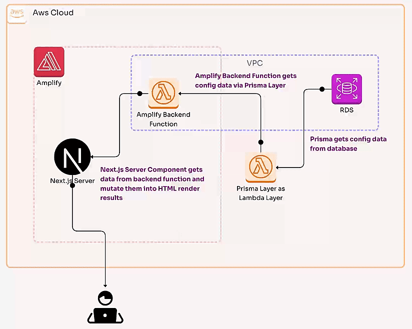

# Takuma's Portfolio

## How to run

This project uses postgres database. By getting some config data from the database, I as a maintainer can manage some of the contents without modifying the source code and redeploying the application. I leverage Server Component to let Next.js server get the config data directly from the database and render it on the page. These config data are embedded in the HTML as a script tag and no API calls happen on the client side, which is more secure than using normal API.



I use npm as package manager for this project, because it works well in any case including CIs.

### Install prisma cli

I use [Prisma](https://www.prisma.io) to manage the database schema and migrations. So you need to install prisma cli to run some commands.

```bash
cd prisma # Go into the prisma layer directory
npx prisma
```

### Generate types for prisma client

You need to generate types using prisma cli to correctly reference types of schema in your IDE. First, you need to install dependencies for the prisma layer.

```bash
npm install
```

Then, run generate command.

```bash
npx prisma generate
```

### Install dependencies for the project

```bash
cd .. # Back to the project root
npm install # This requires prisma layer correctly generated before hand
```

### Prepare database

You need to create a PostgreSQL database that is accessible from an AWS Lambda function you'll create in the future step.

### Deploy prisma migrations

You need to setup your database a bit more. If you create your database without public endpoint (which is secure and recommended way), you need to spinup an EC2 instance in the same VPC as the database to use as a bastion host and establish VPN tunnel to connect the database from your local terminal.

```bash
ssh -L <port_number_i_want_to_use_on_my_local_and_i_recommand_5432_here>:<rds_database_endpoint>:<rds_database_port_number> ec2-user@<bastion_host_PUBLIC_ip> -i <path_to_ssh_key_pair_you_got_from_your_bastion_host_ec2_instance.pem>
```

Now, you should be able to access your database on AWS with host `localhost`. Then, create a database named `portfolio`. Connect to the database and run the following SQL query.

```sql
CREATE DATABASE portfolio;
```

Migrate the schema to the postgres database using prisma cli.

```bash
CONFIG_DATABASE_URL=postgresql://<your-database-user>:<your-database-user-password>@localhost:5432/portfolio npx prisma migrate deploy
```

Notice you need to encode `<your-database-user-password>` with percent encoding to escape special characters in the password string.

Now you have a database works for this project.

### Insert config

Provide the config data to the database, otherwise the application will output console errors and some parts of the page will not work as expected.

```sql
INSERT INTO "public"."Config" ("id", "name", "type", "value") VALUES
(1, 'name', 'STRING', 'Takuma'),
(2, 'repository_url', 'STRING', 'https://github.com/TakumaKira/portfolio'),
(3, 'storybook_url', 'STRING', 'https://takuma-portfolio-storybook.kirakiraworx.com'),
(4, 'cpsaf_certification_url', 'STRING', 'https://www.certible.com/badge/33141297-d6b6-4dff-9d43-f36452d85d5c'),
(5, 'figma_url', 'STRING', 'https://www.figma.com/design/Hcj8I0Y6umFS5mymgsgVKp/Takuma''s-Portfolio-202411');
```

Now, your database is ready and you can close the VPC tunnel.

### Deploy to Amplify

Create a new Ampify project and connect this repository.

It will trigger deployment configured with `/amplify.yml`. It includes deployment of the prisma layer as a Lambda layer, which is also required to run sandbox you can use in the future step.

When the first deployment has done successfully, you need to add some environment variables onto the Amplify project and the backend Lambda function deployed in the `backend` step of `/amplify.yml`.

For the Amplify project, add the following on the page:

```text
PRISMA_LAMBDA_LAYER_ARN: arn:aws:lambda:<your-resource-region>:<your-aws-account-number>:layer:portfolio-prisma:<latest-lambda-layer-version-number>
```

For the backend Lambda function, add:

```text
CONFIG_DATABASE_URL: postgresql://<your-database-user>:<your-database-user-password>@localhost:5432/portfolio
PRISMA_QUERY_ENGINE_LIBRARY: /opt/nodejs/node_modules/portfolio-prisma/node_modules/.prisma/client/libquery_engine-rhel-openssl-1.0.x.so.node
```

Notice you need to encode `<your-database-user-password>` with percent encoding to escape special characters in the password string.

And you'd better use `RDS database connections` configuration on the Lambda function to grant appropriate security group to the function and the database. This would resolve database connection timeout if happened.

Finally, you should be able to access the working web app on the deployed URL as expected.

### Run Next.js locally

```bash
npm run dev
```

### Run Amplify backend functions sandbox for development

```bash
PRISMA_LAMBDA_LAYER_ARN=arn:aws:lambda:<your-resource-region>:<your-aws-account-number>:layer:portfolio-prisma:<latest-lambda-layer-version-number> npx ampx sandbox
```

Notice you also need to add some environment variables for the sandbox Lambda function.

```text
CONFIG_DATABASE_URL: postgresql://<your-database-user>:<your-database-user-password>@localhost:5432/portfolio
PRISMA_QUERY_ENGINE_LIBRARY: /opt/nodejs/node_modules/portfolio-prisma/node_modules/.prisma/client/libquery_engine-rhel-openssl-1.0.x.so.node
```

Notice you need to encode `<your-database-user-password>` with percent encoding to escape special characters in the password string.

And you'd better use `RDS database connections` configuration on the Lambda function to grant appropriate security group to the function and the database. This would resolve database connection timeout if happened.
