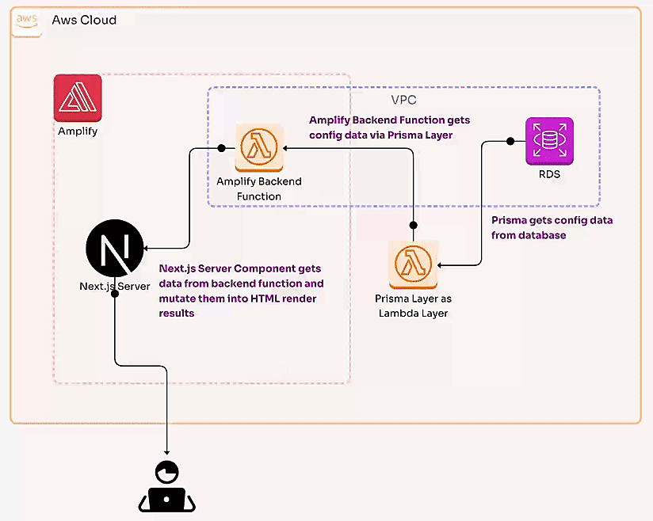

# Takuma's Portfolio

## How to run

This project uses postgres database. By getting some config data from the database, I as a maintainer can manage some of the contents without modifying the source code and redeploying the application. I leverage Server Component to let Next.js server get the config data directly from the database and render it on the page. These config data are embedded in the HTML as a script tag and no API calls happen on the client side, which is more secure than using normal API.



I use npm as package manager for this project, because it works well in any case including CIs.

### Install Prisma and generate types

I use [Prisma](https://www.prisma.io) to manage the database schema and migrations. You need to install dependencies and generate types to correctly reference schema types in your IDE.

```bash
cd prisma # Go into the prisma layer directory
npm install # Installs Prisma 6 and @prisma/client
npx prisma generate # Generates Prisma Client with types
```

### Install dependencies for the project

```bash
cd .. # Back to the project root
npm install # This requires prisma layer correctly generated before hand
```

### Prepare database

You need to create a PostgreSQL database that is accessible from an AWS Lambda function you'll create in the future step.

### Deploy prisma migrations

You need to setup your database a bit more. If you create your database without public endpoint (which is secure and recommended way), you need to spinup an EC2 instance in the same VPC as the database to use as a bastion host and establish VPN tunnel to connect the database from your local terminal.

```bash
ssh -L <port_number_i_want_to_use_on_my_local_and_i_recommand_5432_here>:<rds_database_endpoint>:<rds_database_port_number> ec2-user@<bastion_host_PUBLIC_ip> -i <path_to_ssh_key_pair_you_got_from_your_bastion_host_ec2_instance.pem>
```

Now, you should be able to access your database on AWS with host `localhost`. Then, create a database named `portfolio`. Connect to the database and run the following SQL query.

```sql
CREATE DATABASE portfolio;
```

Migrate the schema to the postgres database using prisma cli.

```bash
DATABASE_URL=postgresql://<your-database-user>:<your-database-user-password>@localhost:5432/portfolio npx prisma migrate deploy
```

Notice you need to encode `<your-database-user-password>` with percent encoding to escape special characters in the password string.

Now you have a database works for this project.

### Insert config

Provide the config data to the database, otherwise the application will output console errors and some parts of the page will not work as expected.

```sql
INSERT INTO "public"."Config" ("id", "name", "type", "value") VALUES
(1, 'name', 'STRING', 'Takuma'),
(2, 'repository_url', 'STRING', 'https://github.com/TakumaKira/portfolio'),
(3, 'storybook_url', 'STRING', 'https://takuma-portfolio-storybook.kirakiraworx.com'),
(4, 'cpsaf_certification_url', 'STRING', 'https://www.certible.com/badge/33141297-d6b6-4dff-9d43-f36452d85d5c'),
(5, 'figma_url', 'STRING', 'https://www.figma.com/design/Hcj8I0Y6umFS5mymgsgVKp/Takuma''s-Portfolio-202411');
```

Now, your database is ready and you can close the VPC tunnel.

## Updating Prisma Version

When updating Prisma to a new version, follow these steps carefully to avoid version conflicts:

### 1. Update Prisma packages in the prisma directory

```bash
cd prisma
npm install prisma@<new-version> @prisma/client@<new-version>
```

### 2. Update package.json to use exact versions

Ensure `prisma/package.json` uses exact versions (not ranges like `^6.0.0`) to match the lock file:

```json
{
  "dependencies": {
    "@prisma/client": "6.17.1"
  },
  "devDependencies": {
    "prisma": "6.17.1"
  }
}
```

### 3. Regenerate the root package-lock.json

The root project depends on the prisma directory via `"portfolio-prisma": "file:prisma"`. You must regenerate the root lock file to reflect the updated Prisma versions:

```bash
cd .. # Back to project root
rm package-lock.json
npm install
```

### 4. Test locally

Verify the setup works locally:

```bash
cd prisma
npm ci # Should work without version conflicts
npx prisma generate
```

### 5. Commit all changes

Commit both the prisma directory changes and the regenerated root `package-lock.json`:

```bash
git add prisma/package.json prisma/package-lock.json package-lock.json
git commit -m "feat: upgrade Prisma to version X.X.X"
```

**Important Notes:**
- Always use exact versions in `prisma/package.json` to prevent `npm ci` sync errors in Amplify builds
- The root `package-lock.json` must be regenerated whenever Prisma versions change
- Amplify caching is disabled to prevent stale version conflicts during builds

### Deploy to Amplify

Create a new Ampify project and connect this repository.

It will trigger deployment configured with `/amplify.yml`. It includes deployment of the prisma layer as a Lambda layer, which is also required to run sandbox you can use in the future step.

When the first deployment has done successfully, you need to add environment variables to the Amplify project. Navigate to: Amplify Console → App Settings → Environment Variables

Add the following variables (one-time setup):

```text
DB_SECRETS_NAME: <your-aws-database-secret-name-on-secrets-manager>
DB_HOST: <your-rds-database-host>
DB_PORT: <your-rds-database-port>
DB_NAME: <your-database-name>
VPC_SUBNET_IDS: <subnet-id-1>,<subnet-id-2>
VPC_SECURITY_GROUP_IDS: <security-group-id>
```

**Note**: `AWS_REGION` and `PRISMA_LAMBDA_LAYER_ARN` are automatically available in Amplify build environment. The Lambda Layer ARN is automatically captured from the `publish-layer-version` command during deployment.

These environment variables will be automatically passed to the Lambda function via the Amplify backend configuration. No manual Lambda configuration is needed after deployment.

**Important**: Ensure the VPC subnets have a NAT gateway or create a VPC endpoint for Secrets Manager access, otherwise the Lambda function will timeout when trying to get the secret from Secrets Manager.

Finally, you should be able to access the working web app on the deployed URL as expected.

### Run Next.js locally

```bash
npm run dev
```

## Backend Deployment Methods

This project has two ways to deploy/test the Amplify backend:

### 1. Amplify Hosted Deployment (via Branch Connection)

**When to use:**
- ✅ Testing changes that affect Lambda Layer (Prisma version upgrades, schema changes)
- ✅ Testing the complete CI/CD pipeline defined in `amplify.yml`
- ✅ Creating staging/production environments
- ✅ When you need a publicly accessible URL for testing

**How it works:**
- Connects a git branch to Amplify Console
- Runs the full `amplify.yml` build process including:
  - Publishing new Lambda Layer with Prisma client
  - Automatically capturing the Layer ARN
  - Deploying backend with the new layer
- Creates isolated environment per branch
- Provides a deployed frontend URL

**Setup:**
1. Connect branch in Amplify Console
2. Set environment variables for the branch (one-time):
   ```
   DB_SECRETS_NAME, DB_HOST, DB_PORT, DB_NAME,
   VPC_SUBNET_IDS, VPC_SECURITY_GROUP_IDS
   ```
3. Trigger deployment (automatic on git push)

**Note**: `AWS_REGION` and `PRISMA_LAMBDA_LAYER_ARN` are automatically available.

### 2. Sandbox (Local Development)

**When to use:**
- ✅ Rapid iteration on backend logic (Lambda function code changes)
- ✅ Testing API/GraphQL schema changes
- ✅ Local frontend development with real AWS backend

**When NOT to use:**
- ❌ Testing Lambda Layer changes (Prisma upgrades, new dependencies)
- ❌ Testing `amplify.yml` build process changes
- ❌ Initial setup or major infrastructure changes

**How it works:**
- Runs `npx ampx sandbox` from your local machine
- Deploys backend resources to AWS (NOT local emulation)
- Uses EXISTING Lambda Layer (doesn't publish new ones)
- Watches for code changes and hot-reloads
- Does NOT run `amplify.yml` build commands

**Important limitation**: Sandbox does not publish Lambda Layers. It uses the most recently published layer from an Amplify hosted deployment. If you upgrade Prisma or change the layer contents, you must first deploy via Amplify hosted deployment to publish the new layer.

### Run Amplify backend functions sandbox for development

First, ensure you have the latest Lambda Layer deployed (this uses the same layer as your production deployment):

```bash
export PRISMA_LAMBDA_LAYER_ARN=$(aws lambda list-layer-versions --layer-name portfolio-prisma --query 'LayerVersions[0].LayerVersionArn' --output text)
```

Then set the remaining environment variables and run the sandbox:

```bash
export DB_SECRETS_NAME=<your-aws-database-secret-name-on-secrets-manager>
export DB_HOST=<your-rds-database-host>
export DB_PORT=<your-rds-database-port>
export DB_NAME=<your-database-name>
export VPC_SUBNET_IDS=<subnet-id-1>,<subnet-id-2>
export VPC_SECURITY_GROUP_IDS=<security-group-id>

npx ampx sandbox
```

**Note**: The sandbox uses the existing Lambda Layer published by your last Amplify deployment. If you've made changes to the Prisma schema, you'll need to trigger an Amplify deployment first to publish a new layer version, or manually publish the layer. `AWS_REGION` is automatically available from your AWS CLI configuration.

The sandbox Lambda function will be automatically configured with VPC settings and IAM permissions via the Amplify backend configuration. After deployment, you may need to manually configure the sandbox Lambda function with "RDS database connections" for initial setup, or ensure it has the correct VPC configuration and security groups.
